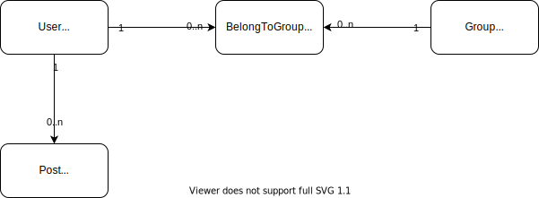

# TypeORM Query Practices

## ER 図

今回対象にするデータベース構造は以下になる。



- Many-to-Many
  - ユーザーは複数のグループに所属できる
  - グループには複数のユーザーが存在している
- One-to-Many
  - ユーザーは記事を投稿できる

## 暗黙的な多対多関係の表現方法

多対多関係を表現する場合には、`@ManyToMany` アノテーションと `@JoinTable` アノテーションを使用する。

これでそれぞれの主キーに該当するカラムをもとに交差テーブルが作成される。なお両方のエンティティに `@ManyToMany` アノテーションを付与すると、暗黙的な交差テーブルが２種類作成されてしまう（主キーの順番が異なるのみ）。

```ts
@Entity()
export class UserImplicit {
  @PrimaryGeneratedColumn()
  id: number;

  @Column()
  name: string;

  @Column()
  email: string;
}

@Entity()
export class GroupImplicit {
  @PrimaryGeneratedColumn()
  id: number;

  @Column()
  name: string;

  @ManyToMany(() => UserImplicit)
  users: UserImplicit[];
}
```

上記の場合に構築されるデータベースは以下である。

- group_implicit
- group_implicit_users_user_implicit
- user_implicit

もしもこの交差テーブルのテーブル名や、紐づけるカラム名を指定したい場合は以下のように指定すればいい。

```ts
@JoinTable({
    // テーブル名を指定する
    name; "users_groups",
    joinColumn: {
        name: "user_id",
        referenceColumnName: "id",
    }
})
```

## 1 体多関係の表現方法

1 対多の関係性を表現する場合には、以下のように `@OneToMany` と `@ManyToOne` アノテーションを使用すればいい。

```ts
@Entity()
export class UserImplicit {
  @PrimaryGeneratedColumn()
  id: number;

  @Column()
  name: string;

  @Column()
  email: string;

  @OneToMany(() => Post, (post) => post.user)
  posts: Post[];
}

@Entity()
export class Post {
  @PrimaryGeneratedColumn()
  id: number;

  @Column()
  title: string;

  @ManyToOne(() => UserImplicit, (user) => user.posts)
  user: UserImplicit;
}
```

この場合はユーザーテーブル自体には変更は発生しないが、Post テーブルにユーザーテーブルとの紐付けが発生する。

- Post
  - `userId: Integer`
  - 外部キーで接続する
